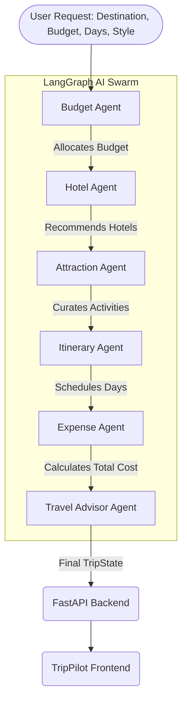

# ✈️ TripPilot AI

> **An intelligent, Agentic AI-powered travel planning assistant that autonomously generates comprehensive and personalized travel itineraries.**

TripPilot AI showcases a modern full-stack architecture combined with an advanced AI agent workflow. It uses a swarm of specialized AI agents to analyze user preferences, allocate budgets, recommend accommodations, discover attractions, and compile day-by-day travel plans.

---

## ✨ Key Features

- **🤖 Agentic AI Workflow:** Utilizes `LangGraph` to coordinate specialized LLM agents (Budget, Hotel, Attraction, Itinerary, Expense, and Advisor).
- **🎨 Modern Frontend:** Built with **Vanilla HTML/JS** and **Tailwind CSS**, featuring a responsive, dark-mode, glassmorphism design with fluid animations.
- **⚡ Robust Backend:** High-performance **FastAPI** backend with automated interactive API documentation (Swagger/OpenAPI).
- **🔒 Secure Data & Auth:** JWT-based user authentication and integrated **SQLite** database managed via `SQLAlchemy` ORM for saving trips and selections.
- **🚀 Scalable Generation:** Intelligent fallback to deterministic trip generation locally when AI services are unavailable or quota-limited.

---

## 🛠️ Technical Stack

### Frontend
- **Framework:** Vanilla HTML5, CSS3, JavaScript
- **Styling:** Tailwind CSS (via CDN)
- **Icons & Animations:** Phosphor Icons, custom CSS transitions

### Backend
- **Framework:** FastAPI (Python 3.10+)
- **AI / LLM Workflow:** LangGraph, LangChain, Google Gemini 2.5 Flash
- **Database & ORM:** SQLite (`trippilot.db`), SQLAlchemy, Pydantic
- **Auth:** JWT, Passlib, Bcrypt

---

## 🏗️ Architecture & AI Agent Pipeline

The application employs a directed graph of AI agents passing a shared state (`TripState`) to one another to progressively build the final trip itinerary. This multi-agent swarm is orchestrated using **LangGraph**.

### The Agent Swarm
1. **Budget Agent:** Intelligently allocates funds across categories (hotel, food, transport, activities, emergency).
2. **Hotel Agent:** Suggests top-rated accommodations based on the allocated budget and travel style.
3. **Attraction Agent:** Curates activities matching user preferences (luxury, budget, adventure, relaxing, etc.).
4. **Itinerary Agent:** Assembles attractions into a logical, day-by-day chronological schedule, taking travel time into account.
5. **Expense Agent:** Re-evaluates the final itinerary and calculates precise estimated total costs.
6. **Advisor Agent:** Provides safety tips, emergency contacts, local transportation advice, and packing lists.

### Agentic Pipeline Diagram



---

## 📂 Project Structure

```text
TripPilot/
├── backend/                  # FastAPI Backend application
│   ├── agents/               # LangGraph AI Agents
│   │   ├── advisor.py        # Travel Advisor Agent
│   │   ├── attraction.py     # Attraction Agent
│   │   ├── budget.py         # Budget Allocation Agent
│   │   ├── expense.py        # Cost Calculation Agent
│   │   ├── graph.py          # LangGraph Workflow Definition
│   │   ├── hotel.py          # Hotel Recommendation Agent
│   │   ├── itinerary.py      # Scheduling Agent
│   │   ├── state.py          # TripState TypedDict definition
│   │   └── llm_config.py     # LLM Provider Configuration
│   ├── database/             # SQLite DB and SQLAlchemy ORM
│   │   ├── database.py       # DB Connection setup
│   │   ├── models.py         # SQLAlchemy Models (SavedSelection, User)
│   │   └── schemas.py        # Pydantic Schemas
│   ├── routes/               # API Routes
│   │   ├── auth.py           # Authentication Endpoints
│   │   ├── trips.py          # Trip Generation & Saving Endpoints
│   │   └── users.py          # User management Endpoints
│   ├── services/             # Helper services (Auth)
│   ├── main.py               # FastAPI App entry point
│   ├── pyproject.toml        # Python dependencies
│   └── .env                  # Environment Variables
│
├── frontend/                 # Vanilla JS / Tailwind Frontend
│   ├── index.html            # Landing Page
│   ├── dashboard.html        # Main Dashboard
│   ├── create-trip.html      # Trip Generation Form
│   ├── results.html          # Generated Trip View
│   ├── api.js                # Backend API Interaction
│   ├── app.js                # UI Logic & State
│   ├── style.css             # Tailwind and custom styles
│   └── ...                   # Other HTML/JS/CSS files
│
└── start_servers.bat         # Windows batch script to start services
```

---

## 🚀 Getting Started

### Prerequisites
- [Python](https://www.python.org/) 3.10+
- Google Gemini API Key

### 1. Backend Setup

1. Navigate to the `backend` directory:
   ```bash
   cd backend
   ```
2. Install dependencies (using pip or poetry):
   ```bash
   pip install -r requirements.txt
   # OR
   poetry install
   ```
3. Configure Environment Variables:
   Ensure your `backend/.env` file has your API key:
   ```env
   GEMINI_API_KEY="your_api_key_here"
   TRIPPILOT_AI_MODE="ai"
   JWT_SECRET="your_jwt_secret"
   ```
4. Start the FastAPI server:
   ```bash
   uvicorn main:app --reload --port 8000
   ```
   *The API will be available at `http://localhost:8000` and Swagger docs at `http://localhost:8000/docs`.*

### 2. Frontend Setup (Zero Build Required)

Because the frontend is built with vanilla HTML/JS and uses Tailwind CSS via CDN, there is absolutely **no build step or Node.js required**.

1. Navigate to the `frontend/` directory.
2. Open `index.html` directly in your web browser (or use VS Code Live Server if you prefer).
3. The frontend will automatically communicate with the backend running on `localhost:8000`.

*Alternatively, run the provided `start_servers.bat` on Windows from the root directory to launch both the backend server and open the frontend automatically.*

---

## 📡 API Overview

The backend exposes a comprehensive RESTful API. Key endpoints include:

- **`POST /trips/`**: Generate a new travel itinerary (Triggers the AI LangGraph pipeline or falls back to local deterministic generation).
- **`GET /trips/saved-selections`**: Retrieve saved trips and selections from the SQLite database.
- **`POST /trips/{trip_id}/save-selection`**: Save a specific hotel or attraction selection to the database.
- **`GET /trips/health`**: Check the status of the AI agent pipeline and backend services.
- **`POST /auth/login`**: Authenticate user and issue JWT token.

For full API documentation, run the backend and visit: [http://localhost:8000/docs](http://localhost:8000/docs).
